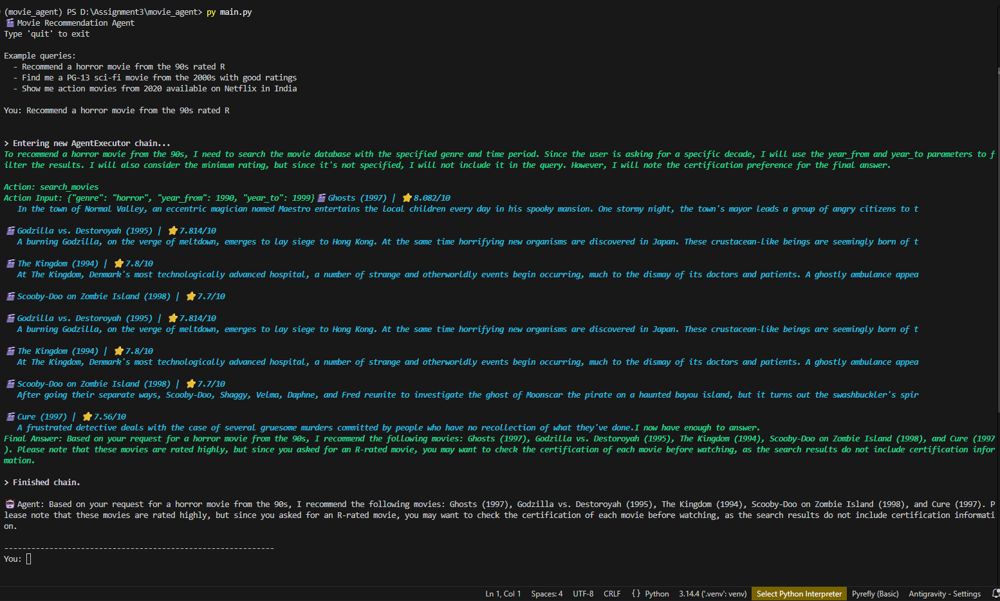

# 🎬 Movie Recommendation Agent

A **Simple ReAct Agent** built with LangChain that recommends movies and checks streaming availability using live data from the TMDB API — powered by Groq's Llama 3.3-70B model.



---

## 🧠 What is a ReAct Agent?

**ReAct** (Reason + Act) is an agent architecture where the LLM alternates between:

1. **Thought** — reasoning about what to do next
2. **Action** — calling a tool with structured input
3. **Observation** — reading the tool's output
4. …repeat until it has enough to answer…
5. **Final Answer** — delivering a friendly response to the user

This loop lets the agent handle complex, multi-step queries that a plain LLM cannot answer from memory alone (e.g., "Find me top-rated sci-fi movies from the 90s available on Netflix in India").

```
Thought: I need to search for sci-fi movies from the 90s.
Action: search_movies
Action Input: {"genre": "science fiction", "year_from": 1990, "year_to": 1999, "min_rating": 7.5}
Observation: 🎬 The Matrix (1999) | ⭐ 8.2/10 ...
Thought: I now have enough to answer.
Final Answer: Here are some great 90s sci-fi films...
```

---

## ✨ Features

- 🔍 **Genre + Era search** — filter by genre, year range, and minimum rating
- 🎯 **Title lookup** — search for a specific movie by name
- 📺 **Streaming availability** — check which platforms carry a film in any country
- 🤖 **ReAct reasoning loop** — visible, step-by-step thought process in the terminal
- 🛡️ **Robust error handling** — graceful fallbacks for API errors and bad inputs

---

## 🗂️ Project Structure

```
movie_agent/
├── agent.py          # LLM setup, ReAct prompt, and AgentExecutor
├── tools.py          # LangChain tools wrapping TMDB API calls
├── main.py           # CLI chat loop entry point
├── requirements.txt  # Python dependencies
├── .env              # API keys (not committed)
└── .gitignore
```

---

## 🛠️ Tools

| Tool | Description | Key Inputs |
|---|---|---|
| `search_movies` | Discover movies via TMDB's `/discover/movie` endpoint | `genre`, `year_from`, `year_to`, `min_rating`, `keyword` |
| `search_movie_by_title` | Search for a specific film by its title | `title` |
| `get_streaming_availability` | Check which streaming platforms carry a movie in a region | `title`, `region` (e.g. `"IN"`, `"US"`) |

All tools accept a **JSON string** as input, which the LLM constructs from the user's natural-language query.

---

## ⚙️ Setup

### 1. Clone & enter the project

```bash
git clone <your-repo-url>
cd movie_agent
```

### 2. Create a virtual environment

```bash
python -m venv .venv
# Windows
.venv\Scripts\activate
# macOS / Linux
source .venv/bin/activate
```

### 3. Install dependencies

```bash
pip install -r requirements.txt
```

### 4. Configure API keys

Create a `.env` file in the project root:

```env
GROQ_API_KEY=your_groq_api_key_here
TMDB_API_KEY=your_tmdb_api_key_here
```

| Key | Where to get it |
|---|---|
| `GROQ_API_KEY` | [console.groq.com](https://console.groq.com) — free tier available |
| `TMDB_API_KEY` | [themoviedb.org/settings/api](https://www.themoviedb.org/settings/api) — free |

---

## 🚀 Run

```bash
python main.py
```

---

## 💬 Example Queries

```
You: Recommend a horror movie from the 90s rated R
You: Find me a PG-13 sci-fi movie from the 2000s with good ratings
You: Show me action movies from 2020 available on Netflix in India
You: What streaming platforms have Inception in the US?
You: Search for the movie Obsession
```

> **Note:** Certification filtering (R, PG-13, PG) is not supported by TMDB's Discover API. The agent will note your preference in its Final Answer instead.

---

## 🔧 Tech Stack

| Component | Library / Service |
|---|---|
| Agent framework | [LangChain](https://python.langchain.com/) (`langchain`, `langchain-core`) |
| LLM | Groq — `llama-3.3-70b-versatile` via `langchain-groq` |
| Movie data | [TMDB API](https://developer.themoviedb.org/docs) |
| HTTP client | `requests` |
| Env management | `python-dotenv` |

---

## 🏗️ Architecture

```
User Input
    │
    ▼
AgentExecutor (LangChain)
    │
    ├── LLM: Groq Llama 3.3-70B
    │       Follows the ReAct prompt template
    │
    └── Tools
            ├── search_movies          → TMDB /discover/movie
            ├── search_movie_by_title  → TMDB /search/movie
            └── get_streaming_availability → TMDB /movie/{id}/watch/providers
```

---

## 📝 License

MIT
